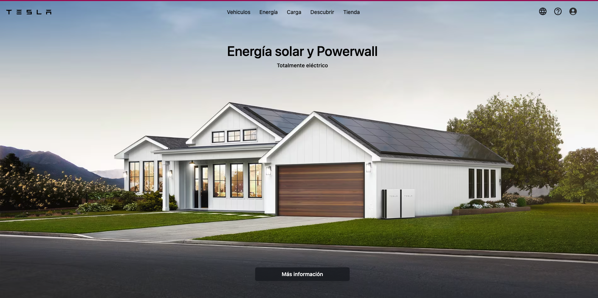

<h1 className="text-2xl text-white font-extrabold uppercase">Tesla Clon | Home</h1>

In this repository I initialize a Vite project where I make the Tesla clone, the home part, with the idea of demonstrating my CSS skills

<section className="mt-5 flex flex-col gap-y-3 max-w-max min-h-screen mx-auto">
        <h1 className="text-xl font-extrabold text-center mt-3">
          Herramientas Con Las Que Se Elaboro El Proyecto
        </h1>
        

          </img>
          
React Js

          </img>
          
Javascript

          </img>
          
Tailwind

          </img>
          
Vite

        

      </section>

