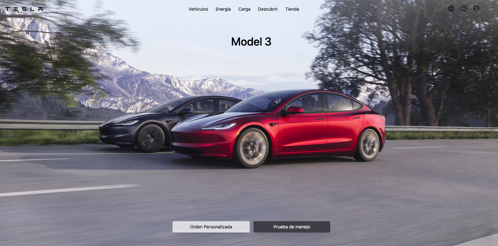

  <h1 style="color:  red">
   Tesla Clon | Home
  </h1>
  

     <h2 style="color: blue">
        - In this repository I initialize a Vite project where I make the Tesla
        clone, the home part, with the idea of demonstrating my CSS skills
      </h2>
  

  

     
      
  

  
 

    <h1 className="text-2xl text-blue-200 font-extrabold mt-3">
        Herramientas Con Las Que Se Elaboro El Proyecto
      </h1>
      
      
      
      
      
      
  

